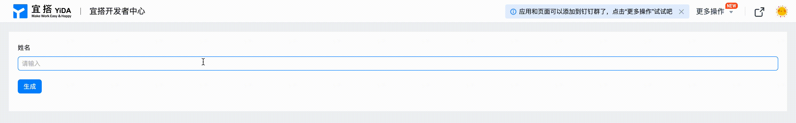

# 快速开始
本篇文档将带领大家快速借助宜搭自定义页面能力搭建一个简单Demo并发布上线，Demo效果如下所示：



通过上面的效果我们可以看到，当用户在输入框中输入姓名并点击生成按钮，程序将自动生成问候语并打印在按钮下方，我们会尽可能详细的讲解每一个步骤，如果用户在这个过程中对于宜搭的产品功能有所疑惑，欢迎移步至[宜搭使用手册](https://www.yuque.com/yida/support/ytzzua)进行查看，下面我们就从0开始来实现上面的Demo效果。


### 步骤1：创建宜搭应用
首先我们需要在宜搭工作台中创建一个应用(详见[使用手册](https://www.yuque.com/yida/support/oncnoy))，如果您已有可用的应用则可以跳过本步，如下所示，我们创建一个名为 ```demo示例``` 的空白应用：


### 步骤2：创建自定义页面
接下来我们需要创建一个自定义页面来实现Demo的功能，如下所示，当前我们还不需要用到页面模板，因此在选择模板环节可以点击 ```跳过``` 按钮直接进入自定义页面设计器：


宜搭的自定义页面设计器如下所示，具体功能介绍详见[设计器文档](guide/designer.md)，开发者可以在进入设计器后修改当前页面的名称：


### 步骤3：拖入组件并配置属性
我们的Demo示例非常简单，总共包含三个组件，开发者可以从组件库面板中将组件先拖入画布，用户也可以前往[组件文档](components/layout/tabsLayout.mdx)查看更多组件配置能力：
* **输入框** - 用于输入姓名，我们将组件的 ```标题``` 属性设置为"姓名"；
* **按钮** - 用于获取用户输入姓名并生成问候语，我们将按钮组件的 ```标题``` 属性设置为"生成"；
* **文本** - 用于显示问候语，为了美观我们在样式面板中设置上边距：20px，字体大小：20px，如下所示；


### 步骤4：创建全局变量
从这一步我们要开始实现逻辑部分了，首先，我们需要创建一个全局变量用于存储问候语（全局变量使用详见[全局变量文档](guide/concept/state.md)），如下所示，我们创建一个名为```helloWord```的全局变量：


### 步骤5：绑定按钮点击事件
我们需要当用户点击按钮时获取输入框的内容，并生成问候语打印在下方，接下来我们将讲解如何绑定事件并生成问候语：

**1.** 给按钮绑定点击事件，如下所示，绑定后我们会在动作面板自动生成一个JS函数（用户也可以自定义函数名）；


**2.** 使用getValue API获取输入框的内容，宜搭提供了非常丰富的[前端API](guide/api.md)，如下所示，我们根据输入框组件的唯一标识获取用户输入内容：


**3.** 构造问候语，并使用setState API更新全局变量的内容触发页面重新渲染，onClick的全部代码如下所示：
```js
export function onClick() {
  // 获取姓名输入框内容
  const name = this.$('textField_kzdxqcod').getValue();

  // 更新全局变量
  this.setState({
    helloWord: `Hello ${name} !`
  });
}
```

### 步骤6：文案绑定数据源变量
最后一步，我们需要将全局变量绑定到文本组件的 ```内容``` 属性上进行展示，如下所示：


### 步骤7：预览&发布
到目前为止，我们的Demo示例就已经开发完成了，用户可以点击设计器右上角的 ```预览``` 按钮进行预览：


完成预览后点击 ```保存``` 按钮保存页面，接下来便可以通过点击应用右上角的访问按钮，访问我们搭建的Demo页面了：


## 最后
到此我们已经完成了快速开始Demo示例的制作，用户可以通过访问[Hello示例](https://www.aliwork.com/APP_D7KLBO4V9PKB3BZHJKH1/custom/FORM-TP866D911EFX9FL1ZUZCUW4INJAQ1P85QWDZKI)查看效果，通过本示例用户可以初步了解宜搭自定义页面的基本使用流程，如果想了解更加复杂的示例教程，可以移步到[TodoMVC教程](tutorial/todoMVC.md)进行查看。


